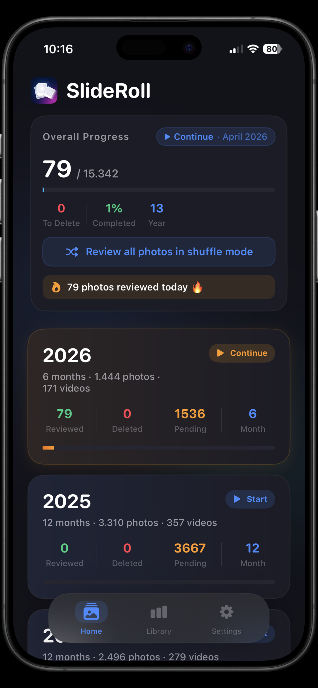
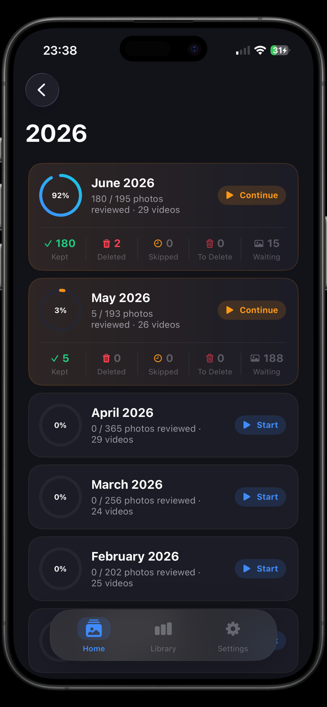
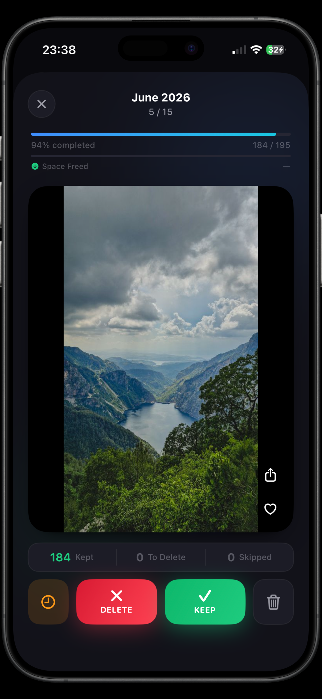
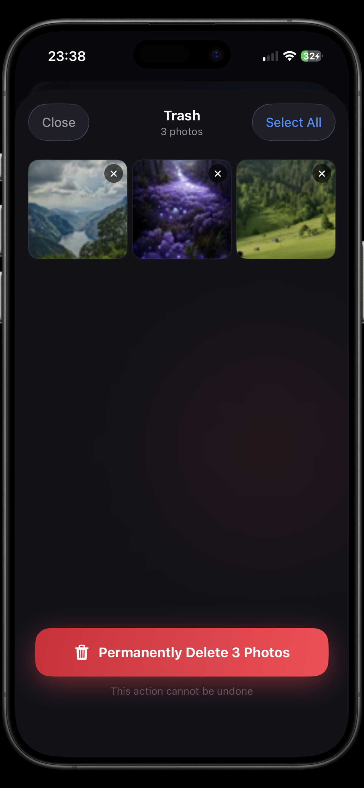
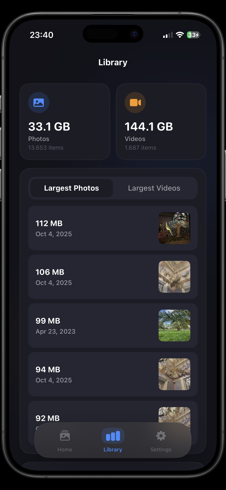

# SlideRoll Website 🌐

**SlideRoll** iOS uygulamasının resmi landing page'i. React + Vite ile geliştirilmiş, 12 dil desteği sunan çok dilli bir web sitesi.

---

## Ekran Görüntüleri

<p align="center">
  
  
  
  
  
</p>

---

## Özellikler

- **12 Dil Desteği** — TR, EN, DE, FR, ES, IT, PT, JA, KO, ZH, RU, AR
- **RTL Desteği** — Arapça için sağdan sola düzen
- **Framer Motion Animasyonları** — Smooth geçişler ve hover efektleri
- **Özel Parçacık Animasyonu** — Canvas tabanlı Sparkles efekti
- **Gizlilik & Destek Sayfaları** — App içi route ile açılan sayfalar
- **Responsive Tasarım** — Mobil ve masaüstü uyumlu
- **Vercel Deployment** — Otomatik CI/CD

---

## Teknoloji

- **React 19** + **TypeScript 6**
- **React Router 7** — SPA routing
- **Framer Motion** — Animasyonlar
- **Vite 8** — Build tool
- **Vercel** — Hosting

---

## Kurulum

```bash
git clone https://github.com/mertkerimi/slideroll-website.git
cd slideroll-website
npm install
npm run dev
```

Uygulama `http://localhost:5173/slideroll/` adresinde çalışır.

---

## Build & Deploy

```bash
npm run build
```

Vercel'e her push'ta otomatik deploy edilir.

---

## Geliştirici

**Mert Kerimi** — [@mertkerimi](https://github.com/mertkerimi)

---

## Lisans

MIT License
